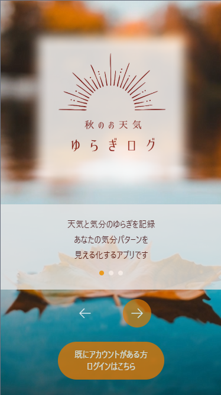
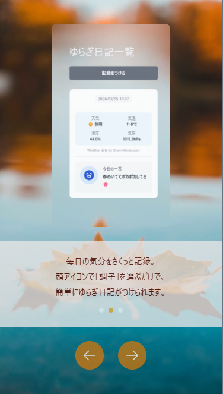
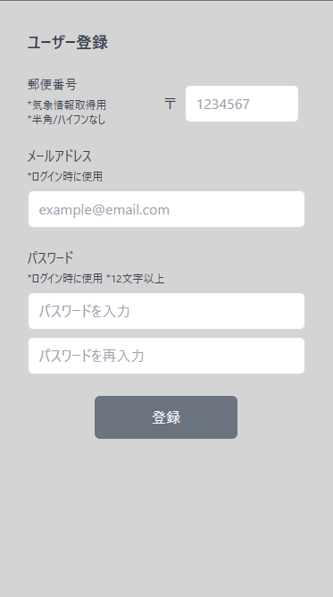
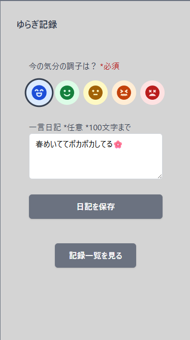
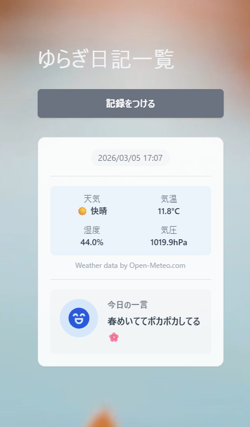

## サービス名  : **秋のお天気🍁ゆらぎログ**

## サービス概要
季節や天候の変化に伴う「心のゆらぎ」を見える化するアプリです。  
気象データと気分ログを組み合わせることで、セルフケアへの気づきにつなげます。

## 開発補足
- RUNTEQミニアプリWeek2025に応募
- 設計から実装までを10日で進め、短期間でプロトタイプを作成
- 生成AIを補助的に活用し、アイデア整理や実装検討の速度を高めた

## お知らせ
現在このサービスの公開は停止しています。画面イメージは、下記でご覧ください。

## コンセプト

- **目的**：天気や気温の変化に伴う気分の揺らぎを客観的に記録・把握できるようにする
- **対象ユーザー**：気象変化で体調が崩れやすい人
- **特徴**：
  - 心とからだをやさしく記録できる心理サポート重視の設計
  - 天気・気温・湿度・気圧と体調ログを照らし合わせて傾向を把握
  - 日々のゆらぎを振り返ることで安心感やセルフケアのヒントにつなげる

## 主な機能

- **天気指数表示**
  - 当日と翌日の天気・気温・湿度・気圧を表示（Open-Meteo API 利用）

- **ゆらぎ日記**
  - 体調を 5 段階スタンプで記録
  - 任意で一言日記を入力（100文字以内）
  - 過去の投稿を日付ごとに気象データと一緒に一覧表示

## 技術スタック

### バックエンド
- Framework: Ruby on Rails
- Database: PostgreSQL
- API連携:
  - Open-Meteo API（天気・気温・湿度・気圧）
  - HeartRails Geo API（郵便番号から緯度・経度を取得）

### フロントエンド
- HTML / CSS / JavaScript（Stimulus）

### 開発環境
- Docker / docker-compose
  - Rails サーバー + PostgreSQL をコンテナ化

### デプロイ
- バックエンド: Render
- フロントエンド: GitHub Pages
